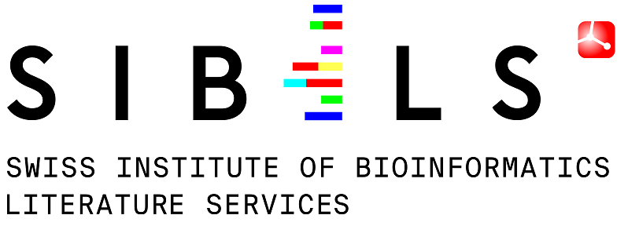

---
hide:
  - navigation
  - toc
---

<h1></h1>

COVID-19 outbreak: explore our literature triage [interface](http://candy.hesge.ch/COVTriage/) and [APIs](http://candy.hesge.ch/COVTriage/documentation/).

## Introduction

This page provides a description of SIBiLS (Swiss Institute of Bioinformatics Literature Services). SIBiLS provide **personalized Information Retrieval** in the biological literature. Indeed, SIBiLS allow **fully customizable search** in **semantically enriched contents**, based on keywords and/or mapped biomedical entities from a growing set of standardized and legacy vocabularies. The services have been used and favourably evaluated to assist the curation of genes and gene products, by delivering **customized literature triage** engines to different curation teams. SIBiLS are freely accessible via **REST APIs** and are **ready to empower any curation workflow**, built on modern technologies scalable with big data: MongoDB and Elasticsearch. 

## Data

SIBiLS cover MEDLINE and PubMed Central Open Access, **daily updated**. Contents are parsed, then enriched by nearly **2 billion of mapped biomedical entities** from reference vocabularies (described [here](doc/vocabularies.md)). Output are json, in JATS-BioC (for fetch) or native Elasticsearch (for search) formats. Today: **34,639,171** MEDLINE citations, along with **900,618,446** tagged bioentities / **5,252,751 PMC** full-texts, along with **2,232,419,175** tagged bioentities. 

## Fetch APIs

They allow to retrieve annotated contents from MEDLINE or PMC Open Access. The input is a set of pmids, or pmcids (up to 1,000 per request). The output is a set of parsed and annotated contents, in both JATS and BioC formats. For MEDLINE citations, delivered and annotated fields include for example abstracts, or MeSH terms; for PMC full texts, paragraphs provided with their hierarchical level in the document structure, or figure captions. Annotations are delivered with many features including the type of the mapped entity (drug, gene, disease...), the vocabulary used, the vocabulary unique identifier and preferred term, or the mapping characters offsets.

* [fetch in MEDLINE](doc/api/fetch_medline.md)
* [fetch in PubMed Central](doc/api/fetch_pmc.md)

## Customizable search APIs

They allow to perform a fully customizable search for valuable documents in MEDLINE or PMC Open Access. The power of these services is based on the efficiency of Elasticsearch engines, and on the rich Lucene query language, which allows to investigate a large panel of searching strategies. For example: basic search with keywords or entity identifiers (“ZBED1” or “NP_NX_O96006”), searches in specified fields (“figures_captions: ZBED1” or “tables: mapped treatments”), boosting fields or query parts, Boolean, exploiting identified concepts or identified concept types... The input is thus a Lucene json query. The output is the Elasticsearch ranked result set in its native json format; for each document (up to 10,000 per request), a relevance score and the indexed content.

* [search in MEDLINE](doc/api/search_medline.md)
* [search in PubMed Central](doc/api/search_pmc.md)

## Reference

SIBiLS are detailed in the 2020 web server issue of Nucleic Acids Research: [SIB Literature Services: RESTful customizable search engines in biomedical literature, enriched with automatically mapped biomedical concepts](https://academic.oup.com/nar/article/48/W1/W12/5831752). Here is the graphical abstract designed for the publication :

<figure markdown>
  { loading=lazy style="width: calc(min(100%, 35rem)); margin: auto;" }
  <figcaption></figcaption>
</figure>

<ul class="partners">
  <li itemscope itemtype="https://schema.org/Organization">
    <a href="https://sib.swiss/" target="_blank" itemprop="url">
      SIB
        
    </a>
  </li>
  <li itemscope itemtype="https://schema.org/Organization">
    <a href="https://www.elixir-europe.org/" target="_blank" itemprop="url">
      Exlir
        
    </a>
  </li>
  <li itemscope itemtype="https://schema.org/Organization">
    <a href="https://www.hesge.ch/heg/" target="_blank" itemprop="url">
      Haute Ecole de Gestion, Genève
        
    </a>
  </li>
  <li itemscope itemtype="https://schema.org/Organization">
    <a href="https://www.swissuniversities.ch/" target="_blank" itemprop="url">
      swissuniversities
        
    </a>
  </li>
  <li itemscope itemtype="https://schema.org/Organization">
    <a href="https://www.hes-so.ch/en/homepage" target="_blank" itemprop="url">
      HES-SO
        
    </a>
  </li>
</ul>
