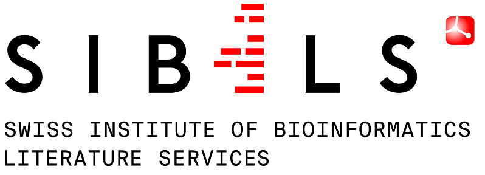
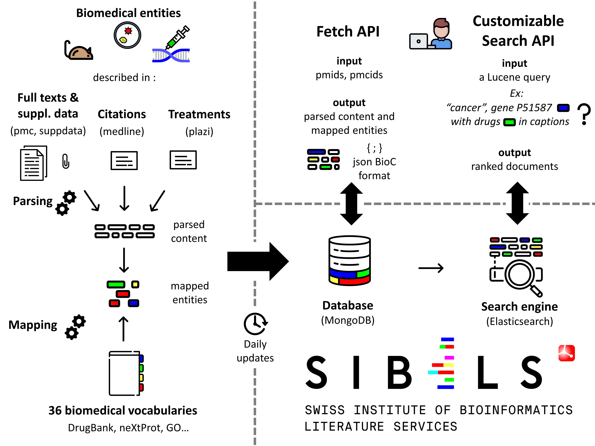
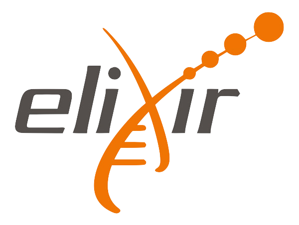
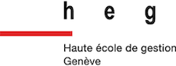

---
hide:
  - navigation
  - toc
---

<h1></h1>

## Introduction

This page provides a description of SIBiLS (Swiss Institute of Bioinformatics Literature Services). SIBiLS provide **personalized Information Retrieval** in the biological literature. Indeed, SIBiLS allow **fully customizable search** in **semantically enriched contents**, based on keywords and/or mapped biomedical entities from a growing set of standardized and legacy vocabularies. The services have been used and favourably evaluated to assist the curation of genes and gene products, by delivering **customized literature triage** engines to different curation teams. SIBiLS are freely accessible via **REST APIs** and are **ready to empower any curation workflow**, built on modern technologies scalable with big data: MongoDB and Elasticsearch. 

  [SIBiLS Search](/search/){ .md-button .md-button--primary }

[]

## Data

SIBiLS today cover 4 collections: MEDLINE, PubMedCentral (PMC), Plazi treatments, and PMC supplementary files. Collections are **daily updated**. Contents are parsed, then enriched by **billions of mapped biomedical entities** from reference vocabularies (described [here](doc/vocabularies.md)). Output are json, in BioC (for fetch) or native Elasticsearch (for search) formats. 

## Fetch API

It allows to retrieve annotated contents from a given collection. The input is a set of document ids (up to 1,000 per request). The output is a set of parsed and annotated contents, in JSON and/or BioC formats. For MEDLINE citations, delivered and annotated fields include for example abstracts, or MeSH terms; for PMC full texts, paragraphs provided with their hierarchical level in the document structure, or figure captions; for supplementary data, text extracted from Excel files or ocerized from images. Annotations are delivered with many features including the type of the mapped entity (drug, gene, disease...), the vocabulary used, the vocabulary unique identifier and preferred term, or the mapping characters offsets.

* [how to fetch](doc/api/fetch.md)

## Customizable search API

It allows to perform a fully customizable search for valuable documents in a given collection. The power of this service is based on the efficiency of Elasticsearch engines, and on the rich Lucene query language, which allows to investigate a large panel of searching strategies. For example: basic search with keywords or entity identifiers (“ZBED1” or “NP_NX_O96006”), searches in specified fields (“figures_captions: ZBED1” or “tables: mapped treatments”), boosting fields or query parts, Boolean, exploiting identified concepts or identified concept types... The input is thus a Lucene json query. The output is the Elasticsearch ranked result set in its native json format; for each document (up to 10,000 per request), a relevance score and the indexed content.

* [how to search](doc/api/search.md)

## Question Answering API

it allows to ask questions in natural languages, and to obtain answers extracted from documents from a given collection. The power of this service is based on previous Elasticserch indexes, and BERT language model. For example: asking for "what diseases are transmitted by ticks ?" in Plazi treatments. The input is a free text question. The output is a set of answers, ranked by scores, along with documents' snippet.

* [how to question](doc/api/qa.md)

## Reference

SIBiLS are detailed in the 2020 web server issue of Nucleic Acids Research: [SIB Literature Services: RESTful customizable search engines in biomedical literature, enriched with automatically mapped biomedical concepts](https://academic.oup.com/nar/article/48/W1/W12/5831752). Here is the graphical abstract designed for the publication :

<figure markdown>
  { loading=lazy style="width: calc(min(100%, 35rem)); margin: auto;" }
  <figcaption></figcaption>
</figure>

<ul class="partners">
  <li itemscope itemtype="https://schema.org/Organization">
    <a href="https://sib.swiss/" target="_blank" itemprop="url">
      SIB
        
    </a>
  </li>
  <li itemscope itemtype="https://schema.org/Organization">
    <a href="https://www.elixir-europe.org/" target="_blank" itemprop="url">
      Exlir
        
    </a>
  </li>
  <li itemscope itemtype="https://schema.org/Organization">
    <a href="https://www.hesge.ch/heg/" target="_blank" itemprop="url">
      Haute Ecole de Gestion, Genève
        
    </a>
  </li>
  <li itemscope itemtype="https://schema.org/Organization">
    <a href="https://www.swissuniversities.ch/" target="_blank" itemprop="url">
      swissuniversities
        
    </a>
  </li>
  <li itemscope itemtype="https://schema.org/Organization">
    <a href="https://www.hes-so.ch/en/homepage" target="_blank" itemprop="url">
      HES-SO
        
    </a>
  </li>
</ul>
