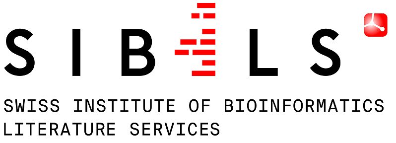
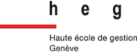
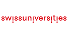

---
hide:
  - navigation
  - toc
---

<h1></h1>

## Introduction

This page provides a description of SIBiLS (Swiss Institute of Bioinformatics Literature Services). SIBiLS provide different services which are freely accessible via **REST APIs** and are **ready to empower any curation workflow**, built on modern technologies scalable with big data.

## Access the services

  [BiodiversityPMC Search](https://biodiversitypmc.sibils.org/){ .md-button .md-button--primary }
  [Variomes](https://variomes.sibils.org/){ .md-button .md-button--primary }
  [Cell Triages](https://celltriage.sibils.org/){ .md-button .md-button--primary }

## Partners

<ul class="partners">
  <li itemscope itemtype="https://schema.org/Organization">
    <a href="https://sib.swiss/" target="_blank" itemprop="url">
      SIB
        
    </a>
  </li>
  <li itemscope itemtype="https://schema.org/Organization">
    <a href="https://www.elixir-europe.org/" target="_blank" itemprop="url">
      Exlir
        
    </a>
  </li>
  <li itemscope itemtype="https://schema.org/Organization">
    <a href="https://www.hesge.ch/heg/" target="_blank" itemprop="url">
      Haute Ecole de Gestion, Genève
        
    </a>
  </li>
  <li itemscope itemtype="https://schema.org/Organization">
    <a href="https://www.swissuniversities.ch/" target="_blank" itemprop="url">
      swissuniversities
        
    </a>
  </li>
  <li itemscope itemtype="https://schema.org/Organization">
    <a href="https://www.hes-so.ch/en/homepage" target="_blank" itemprop="url">
      HES-SO
        
    </a>
  </li>
</ul>
