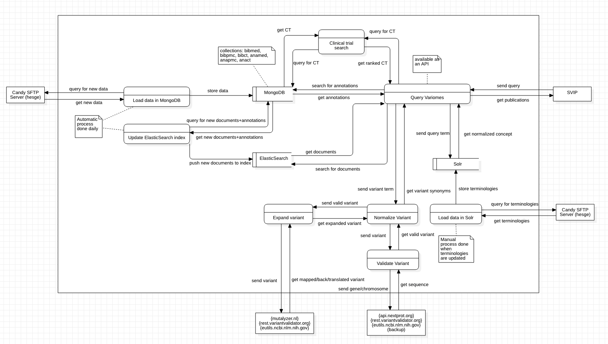

---
hide:
  - toc
---

# Variomes

Precision oncology relies on the use of treatments targeting specific genetic variants. However, identifying clinically actionable variants as well as relevant information likely to be used to treat a patient with a given cancer is a labor-intensive task, which includes searching the literature for a large set of variants. The lack of universally adopted standard nomenclature for variants requires the development of variant-specific literature search engines. We develop a system to perform triage of publications relevant to support an evidence-based decision. Together with providing a ranked list of articles for a given variant, the system is also able to prioritize variants, as found in a Variant Calling Format, assuming that the clinical actionability of a genetic variant is correlated with the volume of literature published about the variant. Our system searches within four pre-annotated document collections: MEDLINE abstracts, PubMed Central full-text articles, supplementary materials associated with publications, and ClinicalTrials.gov clinical trials. A variant synonym generator is used to increase the comprehensiveness of the set of retrieved documents. We then apply different strategies to rank the publications.

  [Variomes](https://variomes.sibils.org){ .md-button .md-button--primary }

## Contact Us

Variomes is developed by the [SIB Text Mining group](https://www.sib.swiss/patrick-ruch-group) at the Swiss Institute of Bioinformatics and the [BiTeM](http://bitem.hesge.ch/) group at the University of Applied Sciences of Western Switzerland (HES-SO).

For question, feedback or bug reporting, please contact [Emilie Pasche](emilie.pasche@hesge.ch).

## Publications

[1] Pasche E, Mottaz A, Gobeill J, Michel PA, Caucheteur D, Naderi N, Ruch P. Assessing the use of supplementary materials to improve genomic variant discovery. Database (Oxford).2023 Mar 31:baad017. doi: 10.1093/database/baad017. [PubMed](https://pubmed.ncbi.nlm.nih.gov/37002680/)

[2] Pasche E, Mottaz A, Caucheteur D, Gobeill J, Michel PA, Ruch P. Variomes: a high recall search engine to support the curation of genomic variants. Bioinformatics.2022 Apr 28:2595–601. doi: 10.1093/bioinformatics/btac146. [PubMed](https://pubmed.ncbi.nlm.nih.gov/35274687/)

[3] Mottaz A, Pasche E, Michel PA, Mottin L, Teodoro D, Ruch P. Designing an Optimal Expansion Method to Improve the Recall of a Genomic Variant Curation-Support Service. Stud Health Technol Inform.2022 May 25:839-843. doi: 10.3233/SHTI220603. [PubMed](https://pubmed.ncbi.nlm.nih.gov/35612222/)

[4] Caucheteur D, Gobeill J, Mottaz A, Pasche E, Michel PA, Mottin L, Stekhoven DJ, Barbié V, Ruch P. Text-mining Services of the Swiss Variant Interpretation Platform for Oncology. Stud Health Technol Inform.2020 Jun 16:884-888. doi: 10.3233/SHTI200288. [PubMed](https://pubmed.ncbi.nlm.nih.gov/32570509/)

## Videos

    

        <table>
            <thead>
                <tr>
                    <th>SIB In Silico Talk</th>
                    <th>Biocuration Conference 2023</th>
                </tr>
            </thead>
            <tbody>
                <tr>
                    <td>
                        <iframe 
                            src="https://www.youtube.com/embed/ovhu5U0EKHQ"
                            frameborder="0"
                            allowfullscreen>
                        </iframe>
                    </td>
                </tr><tr>
                    <td>
                        <iframe
                            src="https://www.youtube.com/embed/x1jtumI7QRM"
                            frameborder="0"
                            allowfullscreen>
                        </iframe>
                    </td>
                </tr>
            </tbody>
        </table>
    

[Link to the source](https://www.sib.swiss/in-silico-talks/variomes-a-search-engine-to-support-the-curation-of-genetic-variants)

[Link to the source](https://biocuration2023.github.io/abstracts)

## Acknowledgements

This Swiss Variant Interpretation Platform (SVIP) project has been supported by the Swiss Personalized Health Network (SPHN) and the BioMedIT infrastructure. SVIP uses an integrated version of the Variomes services to support the curators of the clinical database. We would like to thank the SVIP project team members of the following groups: Clinical Bioinformatics Unit of NEXUS Personalized Health Technologies, SIB Clinical Bioinformatics and Swiss-Prot group, namely Daniel Stekhoven, Valérie Barbié, Anne Estreicher, Livia Famiglietti, Faisal Al Quaddoomi, David Meyer, Linda Grob, Franziska Singer and Nora Toussaint. The work presented in this report is built on top of SIBiLS, the SIB Literature Services, which is supported by the Elixir Data Platform. This work also benefited from discussions with Melissa Cline.

## More about Variomes

<figure markdown>
  { loading=lazy style="margin: auto;" }
  <figcaption></figcaption>
</figure>

## External links

* [Source code: github.com/variomes/sibtm-variomes](https://github.com/variomes/sibtm-variomes)
* [SynVar](https://synvar.text-analytics.ch/)
