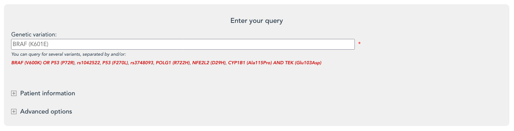

# Tutorial

## How to search in Variomes?

First, you can select the type of query you would like to perform on Variomes.

* Search literature for one variant
  You can search for a single variant or a combination of variants (e.g. multigenic disease). by directly entering a query containing one or more variants into the search bar. Use keywords "AND" and "OR" to mention several variants. You can also enter a rs identifier and Variomes will suggest variants associated with your rs identifier. 

  

## Query processing

## Results